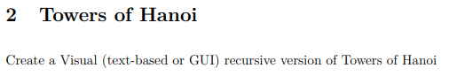
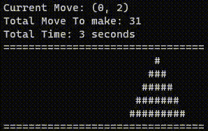

# Tower Of Hanoi Assignment
## Table of Contents
1. [Assignment](#Assignment)
2. [Where to find solutions](#Where-to-find-solutions)
3. [Result of program](#Results-of-test)
4. [How to run](#How-to-run)

## Assignment


## Where to find solutions
- [Game](./Game.cs)
- [Main Program](./Program.cs)

## Result of program
- Running 5 disks, with movemnt each 100 milisecond
- 

## How to run
### 1. Build Docker Image
```
docker build -t towersofhanoi .
```

### 2. Run Docker Image
```
docker run -it --rm towersofhanoi
```