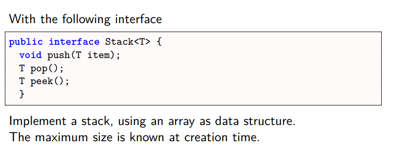

# Stack Exercise

### Exercise 1:

### Exercise 2:


## How to run
### 1. Build Docker Image
```
docker build -t stackexercise .
```

### 2. Run Docker Image
```
docker run -it --rm stackexercise
```