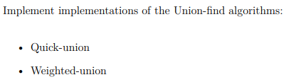
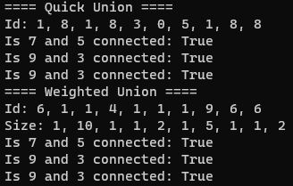

# Union Exercise
## Table of Contents
1. [Exercise](#Exercise)
2. [Where to find solutions](#Where-to-find-solutions)
3. [Results of test](#Results-of-test)
4. [How to run](#How-to-run)

## Exercise:


## Where to find solutions
- [Quick Union Solutions](./Unions/QuickUnion.cs)
- [Weighted Union Solutions](./Unions/WeightedUnion.cs)

## Results of test
- [Test File](./Program.cs)



## How to run
### 1. Build Docker Image
```
docker build -t unionexercise .
```

### 2. Run Docker Image
```
docker run -it --rm unionexercise
```