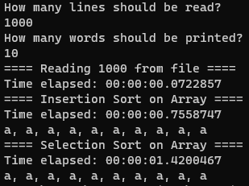

# RealSetExercise
## Table of Contents
1. [Exercise](#Exercise)
2. [Where to find solutions](#Where-to-find-solutions)
3. [Results of test](#Results-of-test)
4. [How to run](#How-to-run)

## Exercise
- Create a generic Sort interface
- Implement Insertion sort and Selection Sort
- Run the sorters with data from [Shakespeare Complete Works](./data/shakespeare-complete-works.txt)
- Time the sorters using a StopWatch

## Where to find solutions
- [Sort Interface](./Sorters/ISort.cs)
- [Insertion Sort](./Sorters/InsertionSort.cs)
- [Selection Sort](./Sorters/SelectionSort.cs)
- [Shakespeare Data Reader](./Utils/FileUtility.cs)
- [StopWatch Utility](./Utils/StopWatchUtility.cs)

## Results of test
- [Test File](./Program.cs)



## How to run
### 1. Build Docker Image
```
docker build -t insertionselectionexercise .
```

### 2. Run Docker Image
```
docker run -it --rm insertionselectionexercise
```