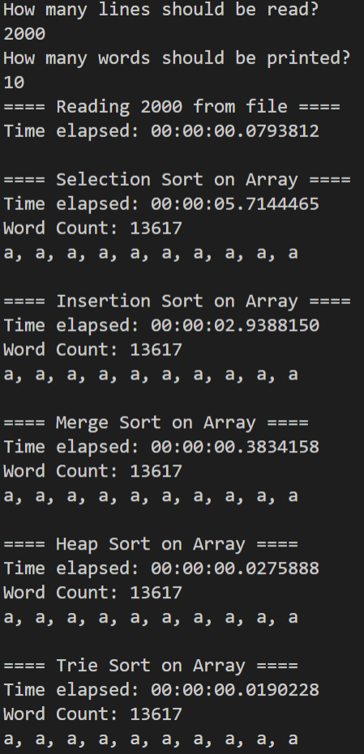

# Insertion And Selection Sort Exercise
Andreas Vikke, Asger Sørensen, Martin Frederiksen, William Huusfeldt
## Table of Contents
1. [Exercise](#Exercise)
2. [Where to find solutions](#Where-to-find-solutions)
3. [Results of test](#Results-of-test)
4. [How to run](#How-to-run)

## Exercise
- Create a generic Sort interface
- Implement the following sorting algorithms:
    - Insertion sort
    - Selection Sort
    - Merge Sort
    - Heap Sort
    - Trie Sort
- Run the sorters with data from [Shakespeare Complete Works](./data/shakespeare-complete-works.txt)
- Time the sorters using a StopWatch

## Where to find solutions
### Sorters:
- [Sort Interface](./Sorters/ISort.cs)
- [Insertion Sort](./Sorters/InsertionSort.cs)
- [Selection Sort](./Sorters/SelectionSort.cs)
- [Merge Sort](./Sorters/MergeSort.cs)
- [Heap Sort](./Sorters/HeapSort.cs)
- [Trie Sort](./Sorters/TrieSort.cs)

#### Utilities:
- [Shakespeare Data Reader](./Utils/FileUtility.cs)
- [StopWatch Utility](./Utils/StopWatchUtility.cs)

## Results of test
- [Test File](./Program.cs)

#### Timings for whole file:
- Insertion sort
    - NaN (Too Long)
- Selection Sort
    - NaN (Too Long)
- Merge Sort
    - NaN (Too Long)
- Heap Sort
    - 4.3318126 sec
- Trie Sort
    - 0.6293269 sec

#### Command Line Output for 2000 lines:


## How to run
### 1. Build Docker Image
```
docker build -t shakespeareassignment .
```

### 2. Run Docker Image
```
docker run -it --rm shakespeareassignment
```